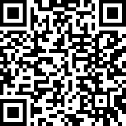

# wx-qq-share #

定制微信，手机QQ，QQ空间APP内的分享内容。

示例：，此示例暂时只提供QQ和QQ空间分享（微信需要配置参数）。

代码参照<http://open.mobile.qq.com/api/component/share>，修改点如下：

1. 将微信改为采用最新版1.4.0，并加入`updateAppMessageShareData`和`updateTimelineShareData`方法；
2. 增加`wxUrl`参数，微信分享链接时该链接域名或路径必须与当前页面对应的公众号JS安全域名一致即可，但手机QQ限制分享URL必须与页面URL同一域名，否则设置不生效，所以此处增加单独设置微信分享链接，仅在微信APP分享时会优先采用；
3. 增加`type`和`dataUrl`参数，用于设置`onMenuShareAppMessage`可使用；
4. 支持`import`引用。

更多关于微信设置的请参照[微信官方文档](https://developers.weixin.qq.com/doc/offiaccount/OA_Web_Apps/JS-SDK.html#10)

## 用法 ##

### 使用模块加载器 ###

```sh
npm install --save-dev @fxss5201/wx-qq-share
```

```javascript
import { setShareInfo } from '@fxss5201/wx-qq-share'

setShareInfo({
  title: 'wx-qq-share定制微信、qq分享', // 分享标题
  summary: '定制微信，手机QQ，QQ空间APP内的分享内容。定制微信，手机QQ，QQ空间APP内的分享内容。', // 分享内容
  pic: 'http://www.fxss5201.cn/wx-qq-share/share.jpg', // 分享图片
  url: 'http://www.fxss5201.cn/wx-qq-share/', // 分享链接
  // wxUrl: '', // 微信分享链接时该链接域名或路径必须与当前页面对应的公众号JS安全域名一致即可
  // 但手机QQ限制分享URL必须与页面URL同一域名，否则设置不生效，所以此处增加单独设置微信分享链接，微信分享会优先采用
  type: '', // 分享类型,music、video或link，不填默认为link
  dataUrl: '', // 如果type是music或video，则要提供数据链接，默认为空
  // 微信权限验证配置信息，若不在微信传播，可忽略
  WXconfig: {
    swapTitleInWX: true, // 是否标题内容互换（仅朋友圈，因朋友圈内只显示标题）
    appId: appId, // 公众号的唯一标识
    timestamp: timestamp, // 生成签名的时间戳
    nonceStr: nonceStr, // 生成签名的随机串
    signature: signature // 签名
  }
})
```

### script 引入 ###

从 [wx-qq-share](https://github.com/fxss5201/wx-qq-share/tree/master/lib) 下载 wx-qq-share.umd.min.js 文件

```html
<script src="js/wx-qq-share.umd.min.js"></script>
<script>
setShareInfo({
  title: '定制微信、qq分享title', // 分享标题
  summary: '定制微信、qq分享title定制微信、qq分享title', // 分享内容
  pic: 'http://www.fxss5201.cn/project/share-test/img/share.jpg', // 分享图片
  url: 'http://www.fxss5201.cn/project/share-test/', // 分享链接
})
</script>
```
